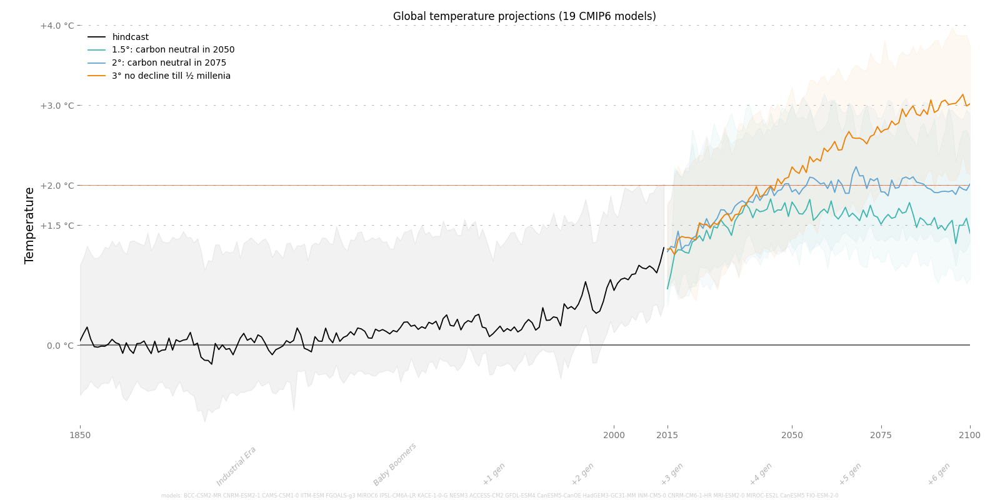

# Climate Change Visualizations
Projections of global temperature or local max temperature according to CMIP IPCC models.

## Work in progress
Currently just a subset of models is read correctly. Despite the trend is representative, the real values might differ. 

# How to run it
1. install libraries in requirements.txt
2. register on (https://cds.climate.copernicus.eu/) and get API keys in the user profile
3. put API keys to ~/.cdsapirc
4. Run ClimateProjections.py

