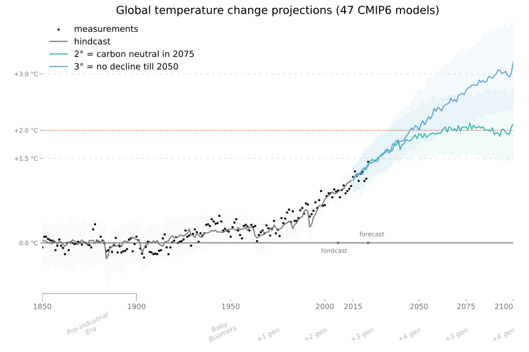

# Climate Change Visualizations

What are the latest projections of climate change?

How likely are they?

Let's visualize the latest knowledge of all CMIP6 models and their variability.

## Global temperature projections

### Models covering most scenarios

### Models covering 1.5 °C scenario (ssp119)

### Context
Averages by the 50th quantile. Ranges by the 10-90th quantile. Normalized to last last 20 years of measurements. 

## Maximum temperature projections

### Maximum temperature in Czechia

### Tropic days annualy in Czechia

### Context: Work In Progress

Maximum temperatures from the summer months: June-August.

This is an early discovery. The max temperature aggregation is yet to be reviewed. 

## Where are the projections from?

The most widely recognized projections are from the __Coupled Model Intercomparison Project, phase 6 (CMIP6)__, run by the _World Climate Research Programme_.

- __CMIP__ is a collaborative framework designed to improve our understanding of climate change through the systematic comparison of climate models. Their work is publicly shared with anyone for use or review.

- CMIP shares __around 40 distinct climate models__ (mid 2024) created by [49 modelling groups](https://wcrp-cmip.github.io/CMIP6_CVs/docs/CMIP6_institution_id.html) from __17 countries all across the world__ from Europe, America, Asia, Australia and Oceania.

### Data Sources
Model data from [_Copernicus Climate Data Store_ ]((https://cds.climate.copernicus.eu/api-how-to)) or [_Earth System Grid Federation Data Portal_](https://aims2.llnl.gov/).

Measurement data from [_Met Office_](https://climate.metoffice.cloud/current_warming.html) and [_Czech Hydrometeorological Institute_](https://www.chmi.cz/historicka-data/pocasi/denni-data/data-ze-stanic-site-RBCN)

## Variance in climate models

To interpret the variance among the CMIP models, the Intergovernmental Panel on Climate Change (IPCC)_ assesses the accuracy of the models by applying statistics to determine which model projections are more consistent with lines of evidence. They combined models by weighting them by their likelihood into an ‘__assessed warming__’ projection in their Sixth Assessment Report (AR6).

Currently, the biggest debate is about so-called _'hot models'_ that predict the highest warming. In the IPCC 'assessed warming', they are considered to be less likely, because they less accurately reproduce historical temperatures over time.

Alternatively, a subset of models with __'TCR'__ between 1.4-2.2 ºC can be used to produce very close results, as described in the [Nature.com article](http://doi.org/10.1038/d41586-022-01192-2). _Nature_, is one of the top scientific journals recognized for its rigorous peer-review process involving multiple rounds of evaluation by experts in the field.

- __TCR: Transient Climate Response__ is the amount of global warming in the year in which atmospheric CO2 concentrations have finally doubled after having steadily increased by 1% every year.

- __IPCC: Intergovernmental Panel on Climate Change__ is an international body established by the _United Nations Environment Programme (UNEP)_ and the World Meteorological Organization (WMO) to assess the scientific, technical, and socio-economic information relevant to understanding the risk of human-induced climate change.
- - The IPCC's assessments are based on the work of thousands of scientists from around the world and are widely regarded as the most comprehensive source of information on climate change.
The IPCC does not conduct its own research but synthesizes existing scientific literature, including that made by CMIP. Its reports go through a rigorous process of review and revision involving experts to ensure accuracy, transparency. They provide policymakers with regular scientific assessments of the current state of knowledge about climate change.

## Future Scenarios

> The largest source of uncertainty in global temperatures in decades to come is the volume of future greenhouse-gas emissions, which are largely under human control.

The scenarios visualized:

1. Reaching worldwide carbon neutrality around 2050 => projected 1.5° global warming – probably out of our reach (ssp119)
2. Carbon neutrality around 2075 => projected 2° global warming – will we make it? (ssp126)
3. No decline of emissions until 2050 => projected 3° global warming (ssp245)
4. Double emissions in 2100 => projected 4° global warming (ssp570)

# How to run it
1. install python libraries in `requirements.txt`
2. Register on Data Store: 
    1. Copernicus (https://cds.climate.copernicus.eu/):
    	- get an API key in your user profile
    	- put your API key to `~/.cdsapirc` as [in this format](https://cds.climate.copernicus.eu/api-how-to)
    2. ESGF (https://esgf.github.io/nodes.html) – any node:
    	- put the open-id you'll get after the registration to `ESGF_OPENID=***` & `ESGF_PASSWORD=***` lines into `~/.esgfenv`
4. change `DATADIR` to the folder point where to download model data
	- Toggle DownloaderCopernicus/DownloaderESGF to get missing models on either of them
5. Run `python3 ClimateProjections.py`
	- Un/comment visualization to be made in `main()` function
	- Update `model` `experiment` when needed

Tested only on python3.

## Downloading

Downloading is tricky, because not all models are available on all servers.

- DownloaderCopernicus is easier to start with, but more models are missing there. 
- DownloaderESGF has more models, but can be hard to tame. It might be necessary to add trusted certificates (an error suggests how) or toggle between `method='wget'` and `method='request'` (example in downloader.py main()) when the method is unable to download a particular model. Also, sometimes a server timeouts. It works, but it probably will be necessary to run it multiple times. Somebody is welcome to contribute by making it more robust.

If you break the download in the process, remove unfinished files not to have holes in the data. One serie is sometimes split into multiple files, so all files with the last ssp experiment and model names are recommended to be deleted in such case to make downloader redownload it.

All models have tens of Gigs. It takes time.